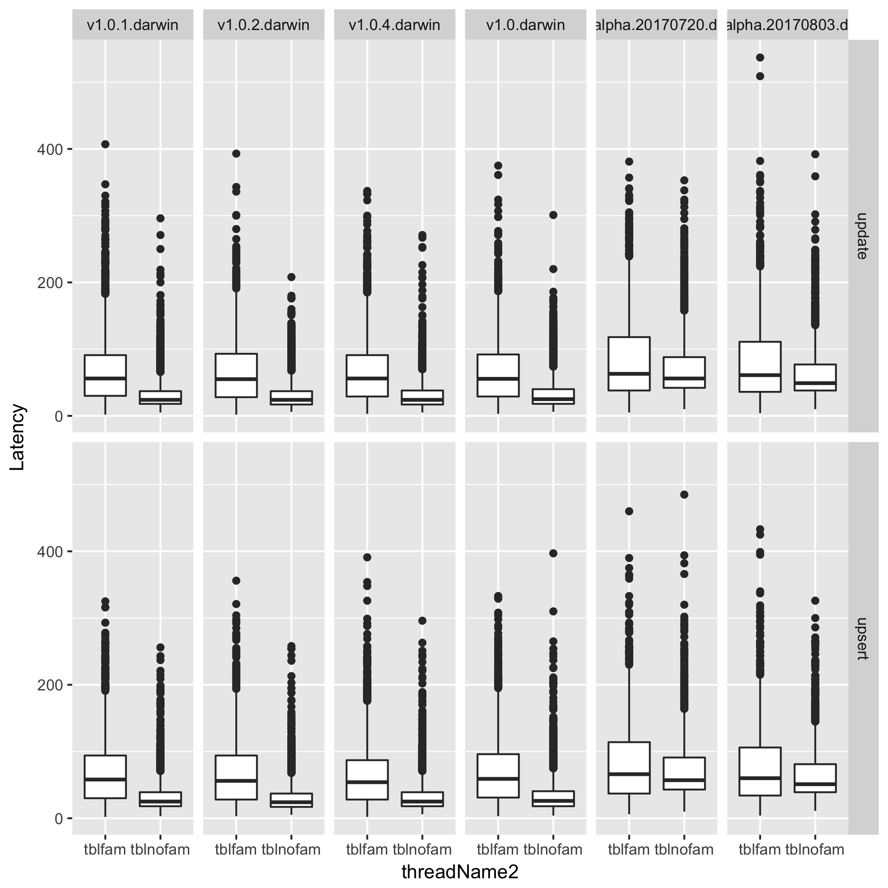

# CockroachDB Column Family Performance Demo

assumptions
~bin has various versions of cockroachdb
~gitHub/crdb-column-family/ is where the scripts are at
roachdemo installed
R require(ggplot2) require(data.table)

```bash 
cd ~/gitHub/crdb-column-family/ 
./crdb-column-family.sh
Rscript crdb-column-family.R
```

Shoud produce 
